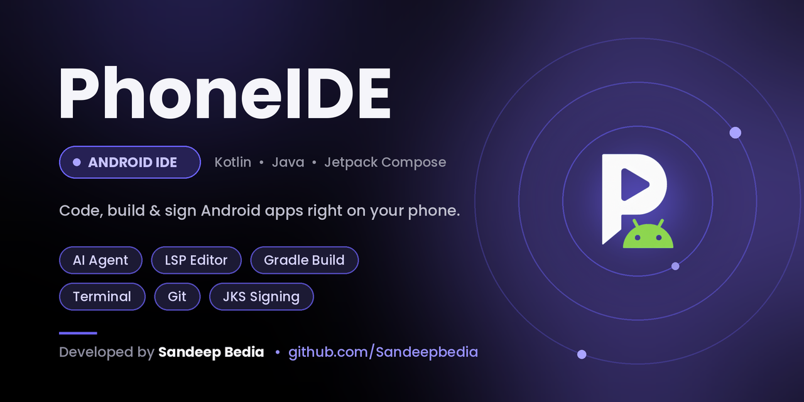

  

  
  
  

<h1 align="center">PhoneIDE</h1>

  A full-featured Android IDE that lives entirely on your phone —
  write, build, sign, preview and ship real Android apps on-device. No PC, no root, no cloud.

  

---

## ✨ Features

### Projects & Build
* [x] Create new Android & Flutter projects from built-in templates
* [x] Open & manage existing Gradle projects on-device
* [x] One-tap Gradle builds with real-time build logs
* [x] Smart build-error detection with auto-remedy suggestions
* [x] Build, sign, inspect & share APKs directly in the app
* [x] Zip export — download your entire project
* [x] File tree explorer with file & content search
* [x] SDK manager screen — install build tools, NDK & more

### Editor & Language Support
* [x] Multi-file tabbed code editor with syntax highlighting & multiple editor themes
* [x] Find & replace across files
* [x] Language servers (each individually enabled):
  * [x] Kotlin / Java language server — smart IDE-style completions
  * [x] XML language support — Android resource auto-complete
  * [x] Dart / Flutter language server
* [x] LSP capabilities: code completion, hover, diagnostics, go-to-definition & quick fixes
* [x] Jetpack Compose + XML layout **live preview** with visual layout inspector

### Linux Environment & Terminal
* [x] Ubuntu rootfs installed inside the app — real Linux, no root required
* [x] Full terminal with PTY & xterm rendering (nano, vi, htop, git…)
* [x] On-device toolchain manager — JDK, Gradle, Android SDK & Flutter downloaded & verified automatically
* [x] Custom environment variables for builds & terminal

### AI Agent
* [x] Fully project-aware AI assistant that reads, edits & runs your code
* [x] 16 built-in agent tools (files, build, search, apply-patch and more)
* [x] Auto bug-fix suggestions & code generation
* [x] Session history with full transcript export

### Signing & Keys
* [x] Create & import JKS / keystore files inside the app
* [x] Sign & resign APKs with your own keys — no PC needed

### Developer Tools
* [x] Icon manager — generate app & adaptive icons visually
* [x] String translator / localization manager (multi-language UI)
* [x] IDE log viewer & process diagnostics
* [x] In-app update checker

### 🚧 Coming Soon (Roadmap)
* [ ] Multi-device preview grid — same UI side-by-side on phone / tablet / foldable presets
* [ ] Dependency updater — notices for outdated libraries right in your build files
* [ ] Plugin system — install extra language servers (Python, Bash, Web) on demand
* [ ] Interactive live preview — test clicks, scrolls & inputs without building an APK

> Suggestions for the roadmap are welcome on Telegram.

---

## 🧩 App Modules

| Module | What it does |
|---|---|
| `editor` | Code editor, Gradle build runner, LSP completions, live preview |
| `project` | Templates, project generator, file tree, search, zip export |
| `terminal` | Ubuntu Linux guest, shell, rootfs installer |
| `toolchain` | On-device tool management (JDK, Gradle, SDK, Flutter) |
| `lsp` | Language Server Protocol client (Kotlin/Java/XML/Dart) |
| `ai` | AI agent — tools, LLM client, sessions, transcript & UI |
| `feature/*` | APK, JKS, icons, preview, settings, SDK, logs, setup wizard |
| `ui` / `data` / `localization` | Theming, app state, i18n |
| `update` | Self-update dialog, manager & background checker |

## 📦 Packages Used

* `androidx.compose.*` — UI (Compose BOM, Material3)
* `com.termux.termux-app:terminal-view` — terminal engine (from Termux)
* `io.github.Rosemoe.sora-editor` — code editor surface
* `io.coil-kt:coil-compose` + `coil-svg` — icon rendering
* `kotlinx-coroutines`, `androidx.work` — async & background jobs
* `commons-compress` + `xz` — rootfs extraction
* Bundled `libproot` native libs — runs the Linux guest without root

## ⚖️ Open Source Licenses

PhoneIDE is built on top of popular open-source projects:

| Library | License | What it does in PhoneIDE |
|---|---|---|
| [Jetpack Compose](https://developer.android.com/jetpack/compose) | Apache License 2.0 | The UI toolkit every screen in PhoneIDE is built with |
| [AndroidX (Activity, Navigation, Lifecycle, WorkManager)](https://developer.android.com/jetpack/androidx) | Apache License 2.0 | Navigation, lifecycle-aware state & background update checks |
| [Material Icons Extended](https://github.com/androidx/androidx) | Apache License 2.0 | The icon set used throughout the app |
| [Kotlin & Kotlin Coroutines](https://github.com/JetBrains/kotlin) | Apache License 2.0 | The language PhoneIDE is written in, and its async runtime |
| [Coil](https://github.com/coil-kt/coil) | Apache License 2.0 | Image loading, incl. the SVG decoder behind file-type icons |
| [Termux](https://github.com/termux/termux-app) | Apache License 2.0 | The terminal engine behind PhoneIDE's embedded Linux shell |
| [sora-editor](https://github.com/Rosemoe/sora-editor) | GNU LGPL v2.1 | The code editor surface used on the editor screen |

> 🙏 PhoneIDE was built entirely on-device using [**AndroStudio**](https://t.me/AndroStudioOfficial) IDE.

## ⚠️ Limitations

* **arm64-v8a devices only** (Android 7.0+, API 24+) — the Linux guest and bundled native libraries only ship for arm64
* **Storage required (one-time downloads):**

  | What you plan to build | Approx. storage needed |
  |---|---|
  | Kotlin / Java / XML projects | ~5 GB |
  | Flutter projects | ~7–8 GB |
  | Both (full toolchain) | ~12–13 GB |

* The app is in active development — feedback and bug reports are welcome on Telegram or GitHub issues

<b>⭐ Star the repo if PhoneIDE helps you build apps on the go!</b>

